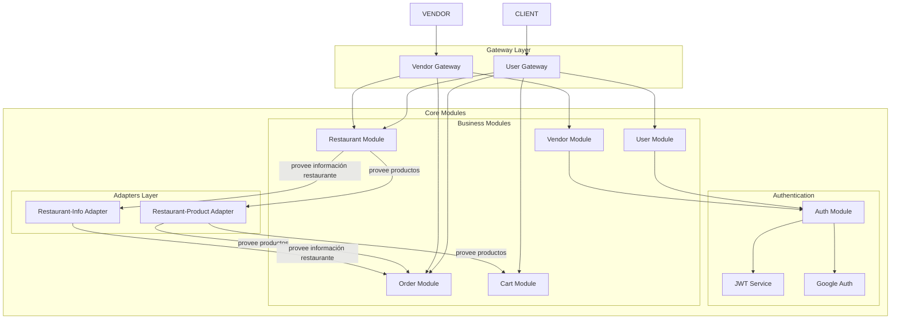

```mermaid
graph TB

    subgraph Gateway Layer
        UG[User Gateway]
        VG[Vendor Gateway]
    end

    subgraph Core Modules
        subgraph Authentication
            AUTH[Auth Module]
            JWT[JWT Service]
            GOOGLE[Google Auth]
        end

        subgraph Business Modules
            UM[User Module]
            VM[Vendor Module]
            OM[Order Module]
            CM[Cart Module]
            RM[Restaurant Module]
        end

        subgraph Adapters Layer
            AD_PROD[Restaurant-Product Adapter]
            AD_RES[Restaurant-Info Adapter]
        end
    end

    %% Client connections
    CLIENT --> UG
    VENDOR --> VG

    %% Gateway connections
    UG --> UM
    UG --> OM
    UG --> CM
    UG --> RM
    VG --> VM
    VG --> OM
    VG --> RM

    %% Auth connections SOLO a User y Vendor
    UM --> AUTH
    VM --> AUTH
    AUTH --> JWT
    AUTH --> GOOGLE

    %% Adapters connections
    AD_PROD -- provee productos --> OM
    AD_PROD -- provee productos --> CM
    RM -- provee productos --> AD_PROD

    AD_RES -- provee información restaurante --> OM
    RM -- provee información restaurante --> AD_RES
```
