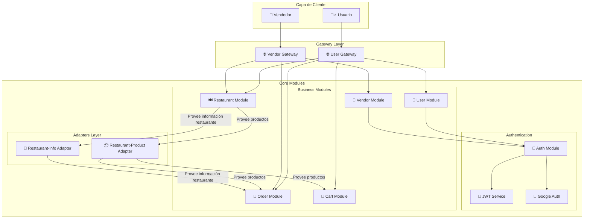

## 🧱 Arquitectura del Proyecto

```mermaid
%% =====================================
%% ARQUITECTURA GENERAL DEL SISTEMA
%% =====================================
graph TB

    %% ==== CLIENTES ====
    subgraph Capa de Cliente
        CLIENT[🧍‍♂️ Usuario]
        VENDOR[🏪 Vendedor]
    end

    %% ==== GATEWAY ====
    subgraph Gateway Layer
        UG[🌐 User Gateway]
        VG[🌐 Vendor Gateway]
    end

    %% ==== CORE ====
    subgraph Core Modules

        %% --- AUTENTICACIÓN ---
        subgraph Authentication
            AUTH[🔐 Auth Module]
            JWT[🔑 JWT Service]
            GOOGLE[🔗 Google Auth]
        end

        %% --- NEGOCIO ---
        subgraph Business Modules
            UM[👤 User Module]
            VM[🏪 Vendor Module]
            OM[🧾 Order Module]
            CM[🛒 Cart Module]
            RM[🍽️ Restaurant Module]
        end

        %% --- ADAPTADORES ---
        subgraph Adapters Layer
            AD_PROD[📦 Restaurant-Product Adapter]
            AD_RES[📍 Restaurant-Info Adapter]
        end
    end

    %% ==== RELACIONES ====
    %% Clientes
    CLIENT --> UG
    VENDOR --> VG

    %% Gateways
    UG --> UM
    UG --> OM
    UG --> CM
    UG --> RM
    VG --> VM
    VG --> OM
    VG --> RM

    %% Autenticación
    UM --> AUTH
    VM --> AUTH
    AUTH --> JWT
    AUTH --> GOOGLE

    %% Adaptadores
    AD_PROD -- "Provee productos" --> OM
    AD_PROD -- "Provee productos" --> CM
    RM -- "Provee productos" --> AD_PROD

    AD_RES -- "Provee información restaurante" --> OM
    RM -- "Provee información restaurante" --> AD_RES
```
